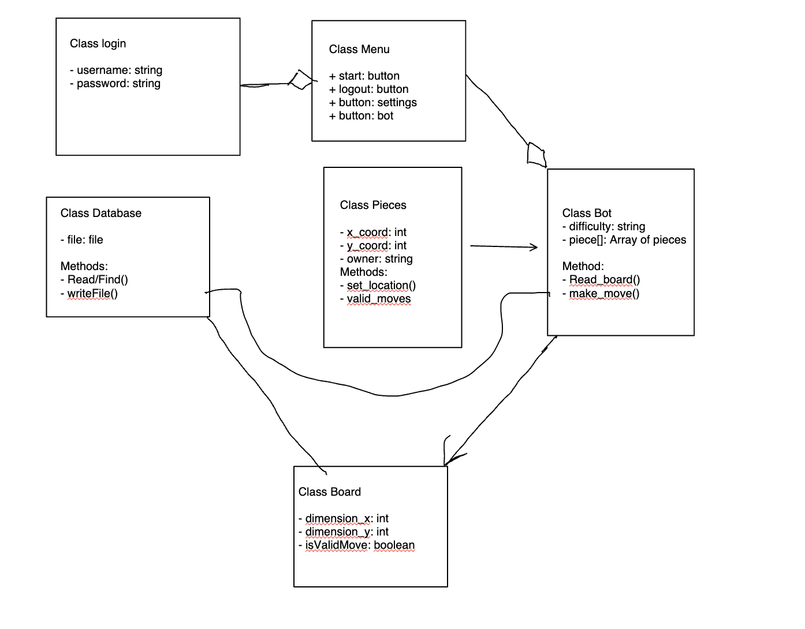

# Meeting Minutes (10/10/2024)

## Administrivia
* Time: 12:20pm
* Location: Fawcett Hall 204
* Scribe: Logan Scarberry

## Agenda
* Complete UML and upload it to meeting notes.
* Write and upload guest lecture markdown document for Tod Irlbeck at Riverside Research.
* Begin revising software development plan schedule due to Mo dropping the class.

## Notes
* Logan and Vichaka discussed the best ways to revise the software development plan.
* Decided to give Mo's job of game functionality to Michael and remove Mo's 'board' task as it seemed redundant.
* Vichaka updated the software development plan to reflect the changes to the gannt chart.
* VIchaka decided to redesign the UML based on Cogan's suggestions on Tuesday at home after class.
* Michael was absent today.

**UML**
  

## Action Items
* Vichaka
  * Continue to work on settings GUI using JavaFX.
  * Finish and upload the UML.
* Logan
  * Continuing to work on the board/GUI using JavaFX.
* Michael
  * Continue with database planning.

## Signatures
* Logan Scarberry
* Vichaka Houi
* ...
