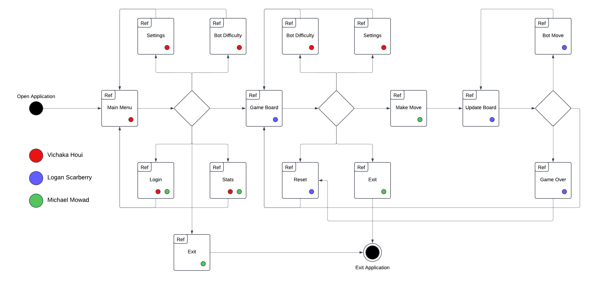

# Design Specifications (MVS)

1. Java GUI using JavaFX

    1.1. A clickable button for Bot difficulty selection and one that can cancel selection 

    1.2. A clickable button for starting a game 

    1.3. A clickable button that brings up a player stat 

    1.4. Has the ability to exit out 

    1.5. A clickable button that brings up a settings menu 

2. Using JavaFX and individual window

    2.1. Login will be implemented using a pop up window with JavaFX with text input for credentials

3. Account System  

    3.1. There shall be a username and password fields. 

    3.2. There shall be a login button. 

	3.3. There shall be an output if wrong username and password is entered. 

4. Leave Button 

    4.1. There shall be a rectangular button 

    4.2. The button shall save the progress of the player in the database.  

5. Java programming  

	5.1. 2 different classes, one for the human player, one for the bot player.  

    5.2. Using a 2d array, design the board using the existent checkers board’s design. 

    5.3. Change the game physics from just pieces moving forward, have them move 	   	        backwards as well. 

6. Database 

	6.1. Utilize a SQLite database with interfacing to Java to implement the databas 

    6.2. One table of the database will contain a log of performed moves and another table 	containing the current board state 

    6.3 One table of the database will contain user IDs and login credentials 

    6.4 One table of the database will contain default settings and related custom settings to 	user IDs 

7. Checkerboard UI 

	7.1. JavaFX may be used as a framework to design the checkerboard GUI. 

	7.2. The inputs made to the checkerboard by the user will be sent to the backend to determine the available moves and that information will be displayed to the GUI in the form of highlighted available moves. 

8. AI 

	8.1. The AI will read from the database to determine the most recent move made and run a method based on the move as well as the difficulty selected by the user to determine the AI's move. 

# Diagrams
Dataflow

Swimlane

UML

Interaction Overview UML Diagram

