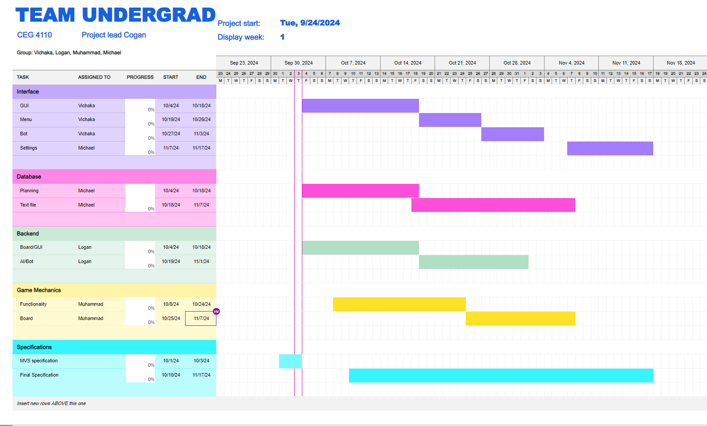

# Software Development Plan

### Communication Plan
* **Administrative**
    - *Meeting Locations* (Decided Weekly)
        - Library
        - Computer Lab in Russ
        - Student Union
        - Russ Lobby
        - Virtual (Discord)
    - *Meeting Times*
        - Every Thursday 12:20~1:20pm
    - *Meeting Layout Reasoning*
        - We had chosen the first four locations as potential quick and easy to get together meetup locations. These locations were easy and accessible right after our classes. In the event that some or all of our members are unavailable, Discord will be available. Thursday after class was chosen because all of us are available at that time. 
    - *Communicating Plan* (Meeting Structure & Cadence)
        - Spend time opening a progress report on one’s current work.
            - In-person and for virtual meetings. 
        - Justification for communication plan - We decided to meet both in-person and have virtual meeting to make it easier if one of the team members miss a meeting.
    - *Project Management*
        - Excel (Gannt chart), word doc and markdown on GitHub
            - Organize thoughts, schedule timings and work progress.
    - *PM Justification*
        - Interface GUI was given two weeks for the purpose of giving enough time to find a proper GUI and implement it. Libraries were also looked at to properly determine which GUI interface was suitable.
        - Interface menu was only given one week because it was deemed to be not too difficult. It goes off as an extension of the GUI as it is mainly getting buttons onto the screen.
        - Interface bot was only given one week because we believe that only a difficulty bot selection is needed here and it does not appear too difficult currently.
        - Board/GUI: Three weeks was given for this as the first week was used to research Java GUI libraries and software platforms before creating that would coincide with the settings GUI also being worked on during this timeframe. The second week was used designing and creating the Checkers GUI.
        - AI/Bot: Two weeks were given for this as the first week will be used to begin work and determine if the two week justification will be adequate by the deadline.
        - Database Planning: Two weeks were given for database planning in order to begin structuring the database while the software begins development.
        - Database: Three weeks were given for the implementation of the database in order to give ample time for the database to be modified as software features are gradually implemented
        - Settings: One week was given for the implementation of the settings feature as it will be one of the final steps in development and simply consists of compiling together existing features.
        - Functionality :  2 Weeks was given for the functionality for the game because we would need to be doing a lot of testing and making a lot of changes to the game functionality in order to have the game work flawlessly, also we are adding more to the checkers regular game rules.
        - Board : For the board two weeks are given because to actually test out the board the rest of the game functionality and all the other components, need to work before we could fully test the board. Also some extra time has been given to test before releasing the final product.
        - Integration was given 25 days to work. This time was given because its the part that merges code and there will still be some other work that is under way. So the programmer can have time to work on previous code that was completed and new code that comes up.

- **SDLC Details**
    - *Scrum*
        - When using scrum, we are actively assigning tasks to one another. Setting deadlines, progress and completion dates.

### Timeline
- **MVSs** (Minimal viable specification)
    - Requirement Specficiation MVS Check-in: 10/03/2024
    - Design Specification MVS Check-in: 10/03/2024
- **Milestones** (Check-Ins)
    - End of the Week (Thursday 12:20~1:20pm)
    - 10/3: Deadline for requirement specification. Will allow us to begin making solutions.
    - 10/3: Deadline for design specification. The list of designs we make will better help guide our path.
    - 10/18: Deadline for GUI design. Will give us access to the front end and page of the program. We can begin adding different features to it.
    - 10/18: Database planning deadline was set to this date in order to have a structured plan for a database once the basis of the software has been developed.
    - 10/24: The game functionality was set to this deadline because the whole of the functionality is needed to for the game board which is gonna come later on, and also seeing all the milestones i can see that before the functionality the board/GUI, database and the ai/bot should be completed.
    - 10/25: Board/GUI deadline was set because as a main top level component, its existence helps us test and continue production for the backend of the checkers game mechanics.
    - 10/26: Deadline for menu selection design. We can now attempt to connect certain programs and features we had planned and test.
    - 11/01: AI/Bot deadline was set for this date as it's components function off of the game mechanics and require the game mechanic backend to function properly.
    - 11/3: Deadline for bot difficulty design selection. Gives the ability to test different selections of bot.
    - 11/07: Database implementation deadline was set to this date as by then most of the primary features of the software have been developed and the database linked to these features.
    - 11/17: Settings deadline was set to this date as it relies on almost all of the software features to have been implemented.
    - 11/17: Final Design and Requirement specification due date was set to this date as it should mark the end of most development   and thus the final draft of these specifications should be completed.
    - 11/21: Integration, this section is for combining current pieces of code to be able to run from each other. Its been given 25 days because other code are still being worked on while in attempt to complete previous work that is ready to merge.
### **Requirement Specification**
    - MVS Check-in: 10/03/24
    - Final Check-in: 11/17/24
1. *Interface*
    * System shall present an interactive menu that consists of several different buttonsv(bot difficulty, start, statistics, and game settings).
    * System shall have a login pop-up.
2. *Account System*
    * The system shall allow the user to sign in using login credentials.
    * The system shall allow the user to save game progress to user login.
    * The system shall savea  logged in user settings to their account.
    * The system shall load saved settings whena  user logs in.
    * Pressing the leave button shall save the game's progress.
3. *Game Mechanics*
    * Movement of the checkers pieces for both human players and the bot.
    * Build the checkers board.
    * Pieces should go forward and backwards.
4. *Database*
    * The system shall utilize a database to store game and user data.
    * The system's database shall store previous moves and board state.
    * The system's database shall store user login credentials.
    * The system's database shall store user settings.
5. *Checkerboard UI*
    * The user shall be able to select a piece on the board and the board will highlight to show available moves.
    * The checkerboard shall consist of 64 squares in an 8x8 layout, alternating dark and light color.
6. *AI*
    * The AI shall read the user input and respond witha  move based on the user's as well as the selected difficulty.
### **Design Specification**
    - MVS Check-in: 10/03/24
    - Final Check-in: 11/17/24
1. *Interface*
    * The Java GUI will be designed using JavaFX/
    * Separate clickable buttons for bot difficulty, starting the game, player stats, settings, and an exit will be created.
    * A leave button shall save the progress of the player in the database.
2. *Account System*
    * There shall be username and password fields.
    * There shall be a login button.
    * There shall be an output if wrong username and password is entered.
3. *Game Mechanics*
    * 2 different classes, one for the human player and one for the bot.
    * Using a 2D array, design the board using the existent checkers board design.
    * Change the game physics from just pieces moving forward, have them move backwards as well.
4. *Database*
    * Utilize a SQLite database with interfacing to Java to implement the database.
    * One table of the database will contain a log of performed moves and another table containing the current board state.
    * One table of the database will contain user IDs and login credentials.
    * One table of the database will contain default settings and related custom settins to user IDs.
5. *Checkerboard UI*
    * JavaFX may be used as a framework to design the checkerboard GUI.
    * THe inputs made to the checkerboard by the user will be sent to the backend to determine the available moves and that information will be displayed to the GUI in the form of highlighted tiles.
6. *AI*
    * The AI will read from the database to determine the most recent move made and run a method based on the move as well as the difficulty selected by the user to determine the AI's move.
- **Gannt Chart**  

