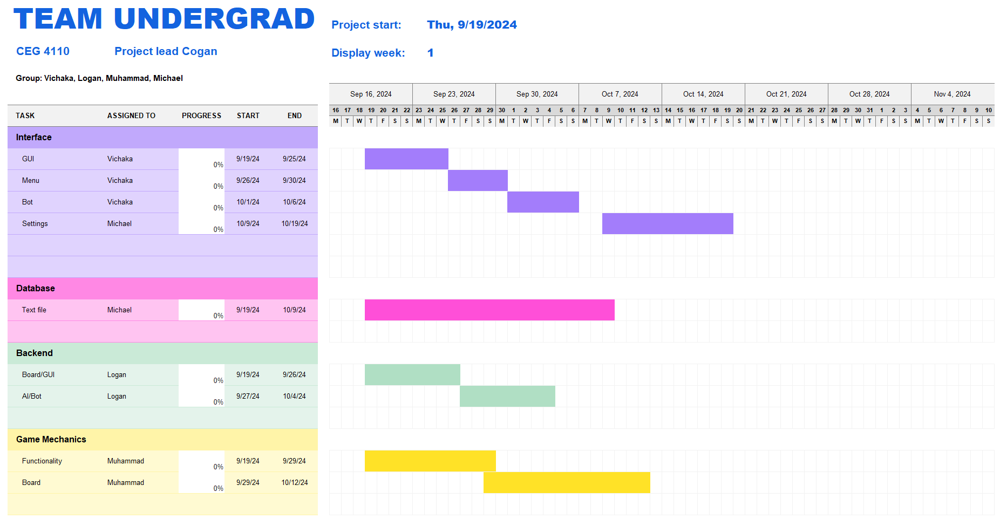

# Software Development Plan

### Communication Plan
* **Administrative**
    - *Meeting Locations*
        - Library
        - Computer Lab in Russ
        - Student Union
        - Russ Lobby
        - Virtual (Discord)
    - *Meeting Times*
        - Every Thursday 12:20~1:20pm 
    - *Communicating Plan* (Meeting Structure & Cadence)
        - Spend time opening a progress report on one’s current work.
            - In-person and for virtual meetings.
    - *Project Management*
        - Excel (Gannt chart), word doc and markdown on GitHub
            - Organize thoughts, schedule timings and work progress.
- **SDLC Details***
    - *Scrum*
        - When using scrum, we are actively assigning tasks to one another. Setting deadlines, progress and completion dates.
- **Timeline** (Dates for)
    - *MVSs* (Minimal viable specification)

### Timeline
- **MVSs** (Minimal viable specification)
    - Game Board GUI
    - Moveable/Functional Game Pieces
- **Milestones** (Check-Ins)
    - End of the Week (Thursday 12:20~1:20pm)
- **Requirement Specification**
    - Allow user to move pieces on a clickable GUI
- **Design Specification**
    - Java-designed game with multiple classes working together to complete functionality.
- **Gannt Chart**  

